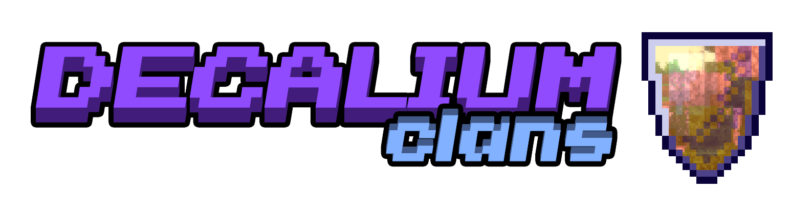

A free, open-source, powerful and performant clans plugin. Like in dreams.

## Features
- A role and clan permission system.
- Clan homes with WorldGuard integration.
- Announcements and clan chat with Carbon hook.
- Clan wars
- PlaceholderAPI support
- Efficient Storage. Plugin takes a full advantage of relation database. At the moment, we support MySQL/MariaDB and H2 databases. 
- Well-designed thread-safe api.
- All messages are configurable, using MiniMessage format.

## Todo
- Multiple server setups support

## Documentation:

https://clans.decalium.ru

~~<b>Currently, there's no stable releases.~~
Check our discord for test builds: https://development.decalium.ru
