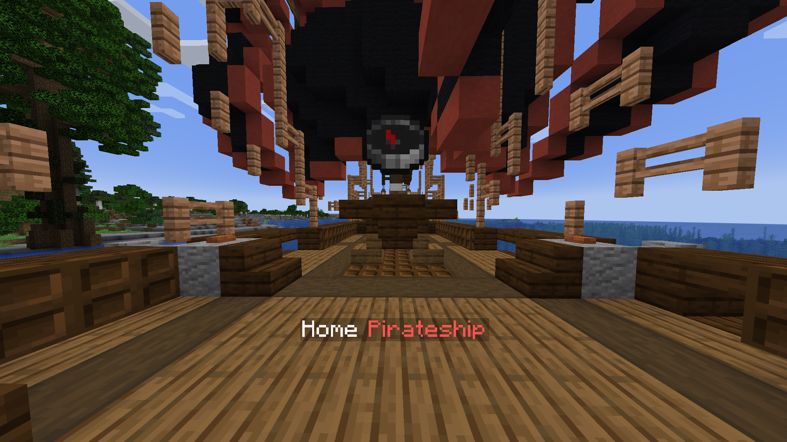

Clan home is a location, where you can keep clan's resources in safety, meet with other members and build cool castles.

Clan can have multiple homes.

Every home has:

- Name
- Display Name
- Owner
- Location
- Icon (an item)
## Creating a home
To create a home, hold some item in your hand. It is going to be used as home icon.
Then simply type

> /clan home create <display_name\>

You can also explicitly set the home *name* with --name flag.

**It is highly recommended to have WorldGuard installed**
If you have one, a protection region and a fancy hologram is going to be created with home:

All clan members will be automatically added as region members.

## Teleporting to home

Use the following command:
> /clan home teleport \<name>

## Deleting a home
To do that, you should be a home owner or have a permission to edit other's homes.

> /clan home delete <name\>

## Renaming a home

> /clan home rename <name\> <new_display_name\>

## Upgrading a home

You can upgrade homes. Higher level means higher protection radius. To do that, use

> /clan home upgrade <name\>

You can setup a home limit per clan, the region size, region flags, 
hologram format and max display name size in config.yml.

