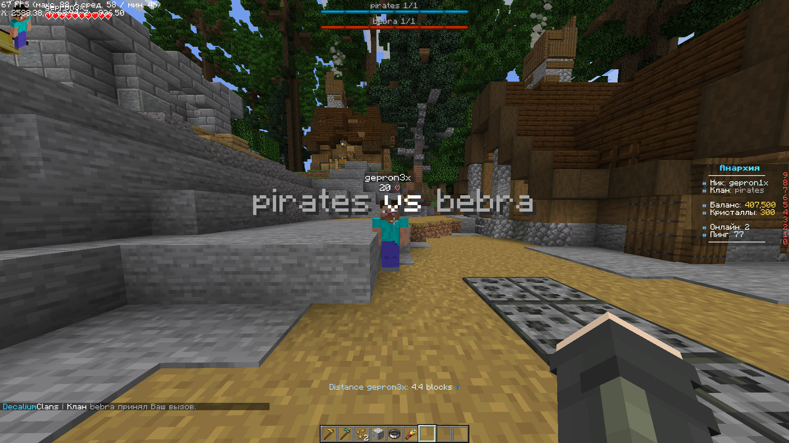

Clan war is fight between 2 clans. All online members participate in the war.
The goal is easy: Kill opponent's clan members. 
If player leaves the game. he loses all items and automatically marked as dead.

## Sending a war request

To start a war, you need to send a war request to your opponent. Type

> /clan war request <tag\>

You need a special clan permission to send requests.

All members of opponent clan will receive a notification, and would be able to accept the war.

## Accepting and declining war requests
To accept or decline incoming war requests use
> /clan war accept/decline <tag\>

You also need a clan permission to do that.

## The war process
Once war request is accepted, The title will be shown to all teams:

As you can see, there's two bossbars, displaying status of teams. They will dynamically change on deaths.

There's also a navigation system in the actionbar, showing you the distance and direction to nearest enemy.

